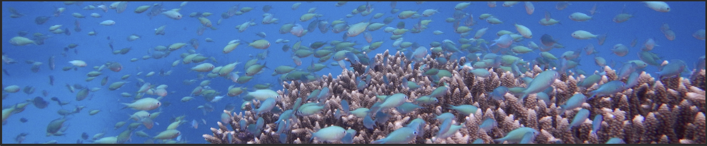

---
title: "Marine Ecological Theory Lab"
---
 
**PI: Lisa C. McManus**
 
I'm an Assistant Research Professor at the <a href="http://www.himb.hawaii.edu/"> Hawai'i Institute of Marine Biology </a> (University of Hawai'i-Manoa). Please get in touch if you're interested in joining the lab! 

{
width=100% }
 
mcmanusl (at) hawaii.edu  
Assitant Research Professor  
Hawai'i Institute of Marine Biology  
University of Hawai'i at Manoa  

 
 
<a href="https://scholar.google.com/citations?user=V3bswmgAAAAJ&hl=en"> {width=6%} </a>

