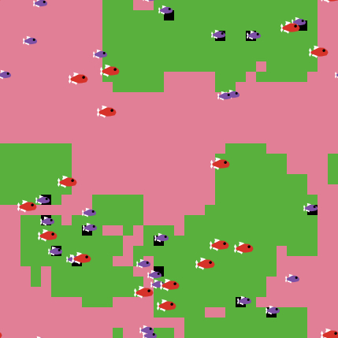

### New Brunswick High School agent-based modeling project  
During the 2018 and 2019 school years, Dr. McManus worked with the <a href="http://hs.nbpschools.net/"> New Brunswick High School </a> Science, Technology, Engineering and Mathematics Club </a> on an agent-based modeling project based the coral-algal competition. We use the NetLogo programming language through <a href="https://netlogoweb.org"> NetLogo Web</a>. Below are some of the materials used during this informal course and project.  

#### Presentation PDFs
<a href="./NBHS/Lesson1.pdf"> Lesson 1 </a>  
<a href="./NBHS/Lesson2.pdf"> Lesson 2 </a>  
<a href="./NBHS/Lesson3.pdf"> Lesson 3 </a>  
<a href="./NBHS/Lesson4.pdf"> Lesson 4 </a>  
<a href="./NBHS/Lesson5.pdf"> Lesson 5 </a>  

#### NetLogo project files (.nlogo)
<a href="./NBHS/coral_algaeV1.nlogo" download> Coral-Algae Version 1 </a>  
<a href="./NBHS/coral_algaeV2.nlogo" download> Coral-Algae Version 2 </a>  

#### Tutorial PDFs to accompany the project files
<a href="./NBHS/coral_algaeV1.pdf"> Coral-Algae Version 1 </a>  
<a href="./NBHS/coral_algaeV2.pdf"> Coral-Algae Version 2 </a>  