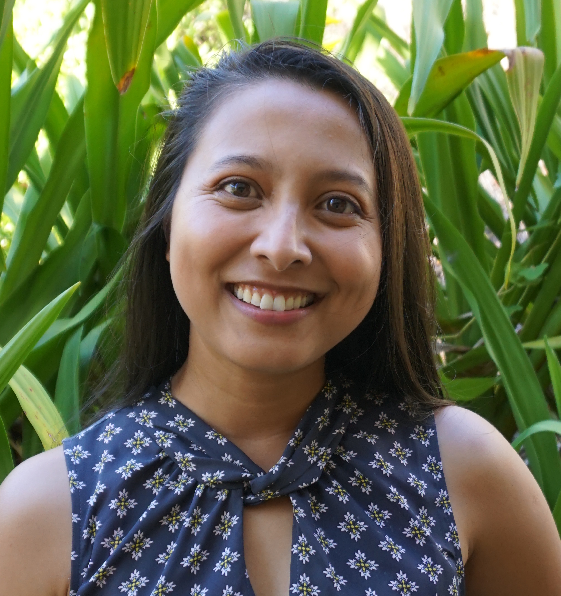
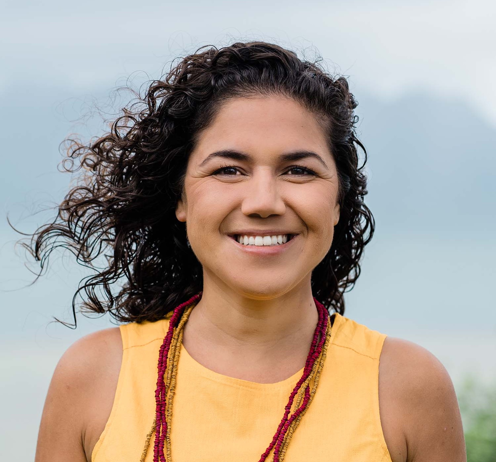
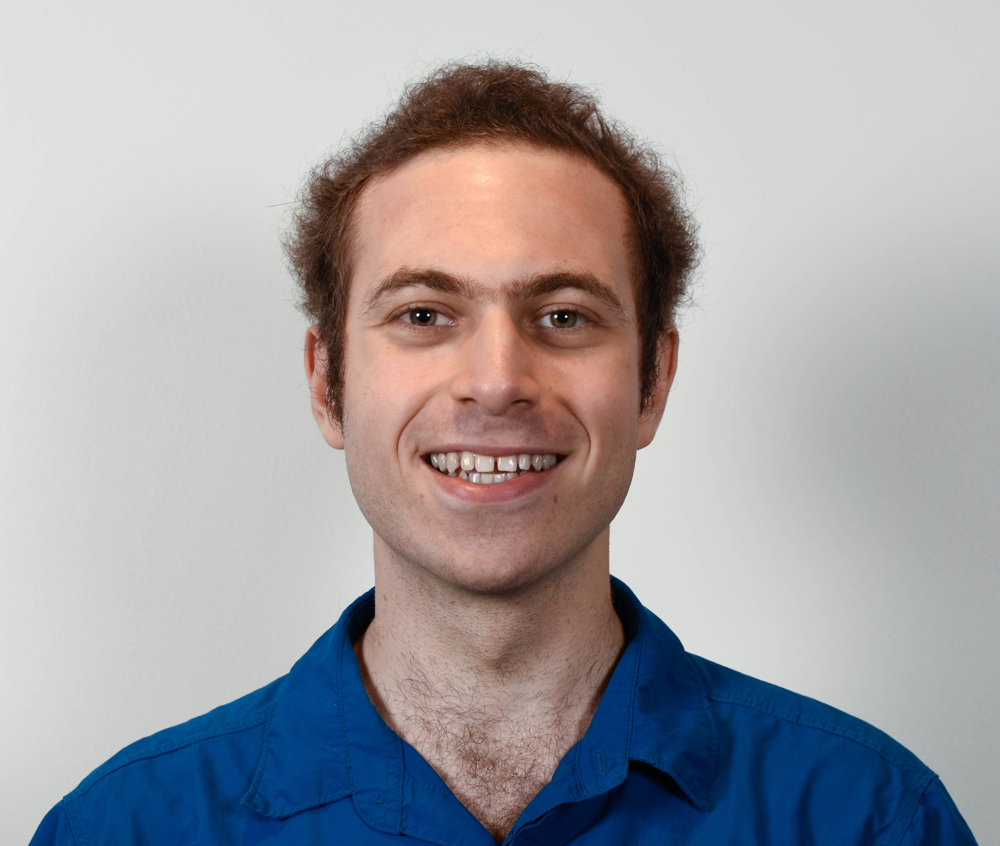
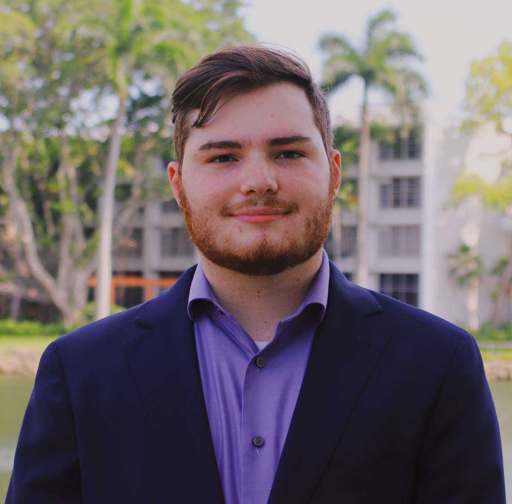
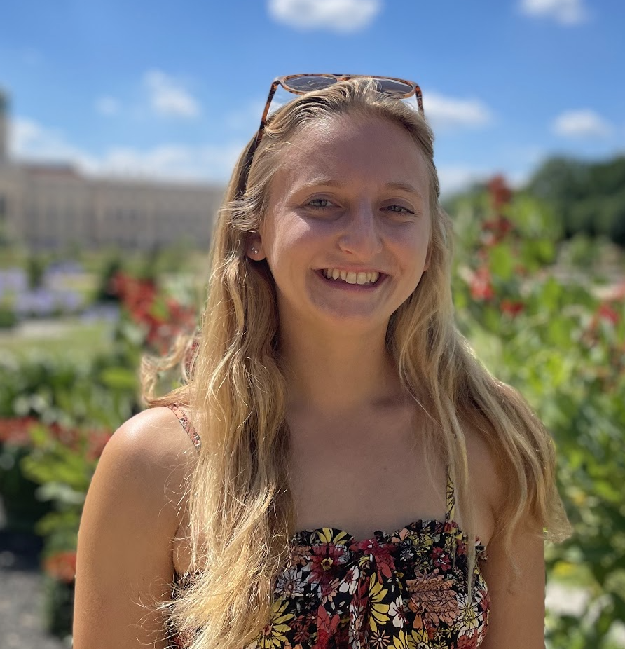
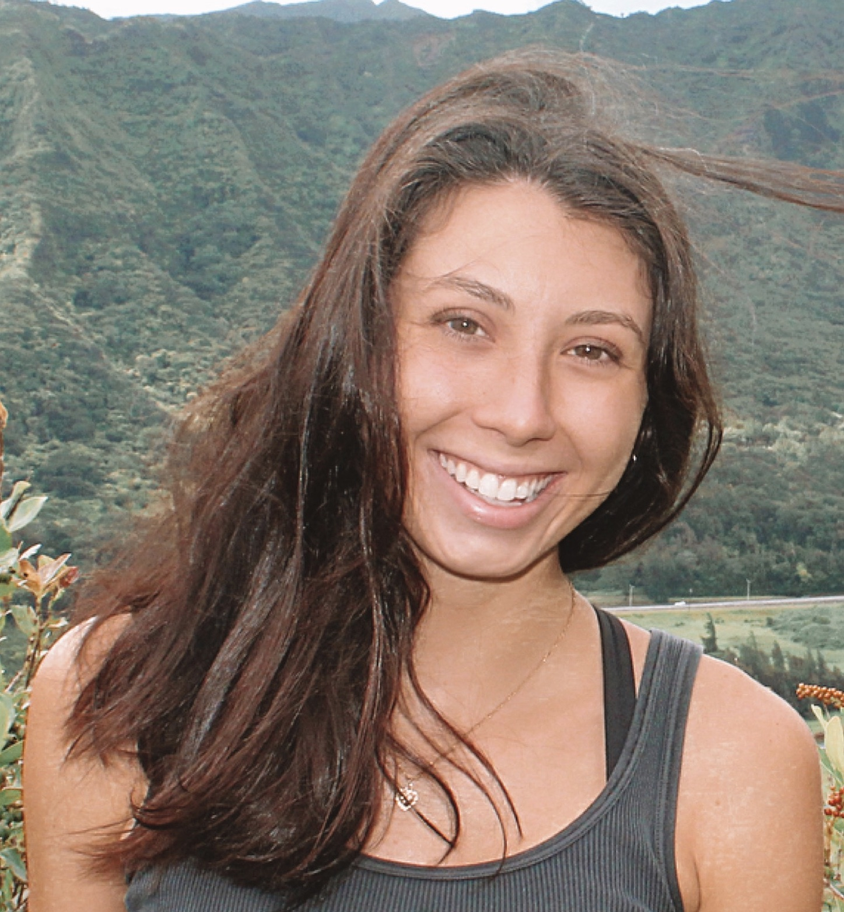
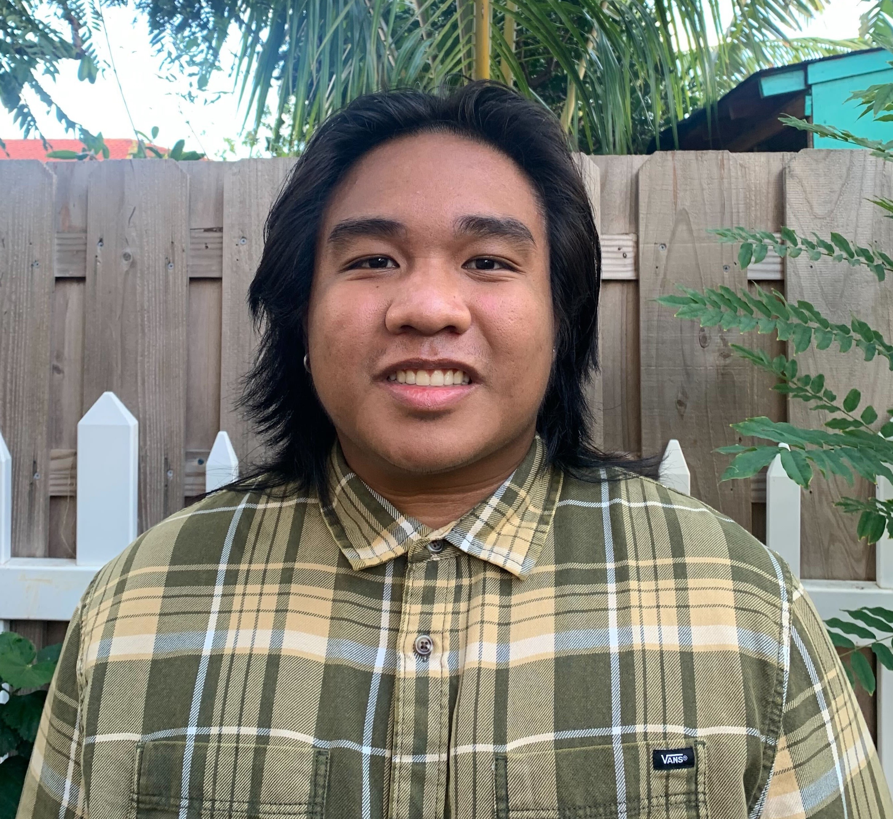

 PI: Lisa C. McManus, Ph.D. - <a href="McManus_Lisa_CV.pdf">CV</a>   
 mcmanusl (at) hawaii (dot) edu   
 

  
I'm a marine ecologist and theoretician working at the <a href="http://www.himb.hawaii.edu/"> Hawai'i Institute of Marine Biology </a> (University of Hawai'i-Manoa) as an Assistant Research Professor. My research focuses on the ecological and evolutionary drivers of coral reef dynamics, and I'm particuarly interested in the effects of climate change on coral population persistence. I met my first corals in the waters off a small coastal town in the Philippines called Bolinao, where I spent the earliest years of my life. I've since explored reefs all over the world, though I've spent most of my scientific underwater time in the central Philippines and Florida Keys.

I use mathematical and computational approaches to investigate the role of networks on coral adaptive capacity using <a href="https://doi.org/10.1101/2021.02.04.429453">an eco-evolutionary framework that incorporates competition, dispersal and directional selection</a>. I've also conducted work to understand the factors that maintain stability on reefs, including the possibility of alternative stable states, both at <a href="https://doi.org/10.1007/s12080-018-0388-x">a single reef patch</a> and across thousands of reefs in <a href="https://doi.org/10.1111/gcb.14972">the Coral Triangle</a>. Many of my models use larval dispersal estimates derived from ocean circulation models.

I earned my Bachelor's degree from the University of Miami's Rosenstiel School of Marine and Atmospheric Science, and my PhD from the Department of Ecology and Evolutionary Biology at Princeton University through the <a href="https://slevin.princeton.edu/">Levin Lab</a>. I was subsequently a postdoctoral fellow at the 
<a href="https://pinsky.marine.rutgers.edu/">Pinsky Lab</a> at Rutgers University.  

 
 
<a href="https://scholar.google.com/citations?user=V3bswmgAAAAJ&hl=en"> {width=6%} </a>

 
 
 Postdoctoral Researchers   

 Mariana Rocha de Souza, M.Sc., Ph.D.   
 mrds (at) hawaii (dot) edu   
 

I am a coral reef biologist interested on the drivers of coral resilience in the face of climate change, especially the role of the symbiont algae in promoting resilience and recovery to inform conservation strategies. In my research, I have used genetics and <a href="https://www.frontiersin.org/articles/10.3389/fmars.2023.1108365/full">monitoring techniques</a> to identify the algal symbiont present in corals under different <a href="https://royalsocietypublishing.org/doi/full/10.1098/rsos.212042">environmental conditions</a>, <a href="https://www.researchsquare.com/article/rs-640089/v1">stress exposures</a> and bleaching events as well as patterns of coral <a href="https://onlinelibrary.wiley.com/doi/full/10.1111/mec.16655">genetic diversity</a>. I was born and raised in Brazil, and feel in love with the ocean, from a young age, when visiting beaches near my hometown. I have since been lucky to explore reefs in different parts of the world (Palau, Red Sea, Moorea, Australia) but I have spent most of my underwater time in Hawaiʻi.
I am also very interested in the intersection of science and policy. After my PhD, I was a John A. Knauss marine fellow placed at the Global Ocean Monitoring and Observing Systems at NOAA. I am also part of the conservation committee of the International Coral Reef Society and attend COPs as part of their delegation to advocate for coral conservation. As a Latina, I actively try to promote inclusion and diversity in science through continuous outreach efforts in schools and podcasts.
I earned my Ph.D in marine biology at the University of Hawaiʻi  at Mānoa at the Hawaiʻi Institute of Marine Biology under Ruth Gates and Rob Toonen, my masters in Oceanography at the University Aix Marseille, France and my BA in biology at the University of São Paulo, Brazil. 

 

 Noam Vogt-Vincent, Ph.D.   
 nvogt (at) hawaii (dot) edu   
 

I’m a Postdoctoral Research Fellow, researching coral reef range expansion and eco-evolutionary dynamics in response to environmental change. My research at HIMB is supported by the NOAA Climate & Global Change Postdoctoral Program. I completed my Master’s degree in Earth Sciences at the University of Oxford, specialising in palaeoclimate and physical oceanography. I stayed at Oxford for my PhD, which focused on marine dispersal in the western Indian Ocean, specifically marine pollution transport to remote islands, and the large-scale connectivity of coral reef systems. I enjoy working across oceanography, geology and ecology to solve environmental problems, and am also enthusiastic about data visualisation and open science.

 
 
 
 
 Graduate Students   

 Nathan Fitzpatrick   
 nmf68 (at) hawaii (dot) edu   
 

I am a current PhD student and researcher at the University of Hawai'i, Manoa studying Marine Biology. I graduated from the University of Miami with a bachelors in Marine Biology and Computer Science. I employ my computational background in my research in the marine sciences across a variety of methods such as agent based modelling, numerical modelling, and machine learning techniques. I specifically have an interest in modeling ecological systems and am currently working with machine learning supervised models of ecological regime shifts.
 
 
 
 
 
 
 
 

 Annie Innes-Gold   
 ainnesgo (at) hawaii (dot) edu   
 

I’m a Ph.D. student interested in coral reef ecology and ecosystem-based fisheries management, and hope to use my background in interdisciplinary research to explore questions relating to environmental and fisheries sustainability. Currently, I’m using ecosystem modeling to study the interactive effects of management strategy and climate change on fish populations and fisheries harvest.

 
 
 
 

<a href="https://scholar.google.com/citations?hl=en&oi=ao&user=CdMYGJ0AAAAJ&inst=18159185193906785217"> {width=6%} </a>

 
 

 Sophia Rahnke   
 srahnke (at) hawaii (dot) edu   
 

I'm a Ph.D. student broadly interested in the biology, ecology, and conservation of coral reef ecosystems. I'm particularly interested in studying questions at the intersection of biology and policy, and hope that my work will connect these components to achieve conservation and sustainability goals. My research will use modeling as a tool to understand coral reef fisheries as social-ecological systems and assess the effectiveness of different forms of management in Hawaiʻi under predicted climate change scenarios. 

 
 
 
 
 
 
 
 

 Jake Snyder   
 jtsnyder (at) hawaii (dot) edu   
 

Hi! My name is Jake Snyder (he/they), and I am a 1st-year Ph.D. student researching the impact of sedimentation on the interactions between fish herbivory, algal cover, and coral growth. I was raised in Hummelstown, Pennsylvania, and I earned my Bachelor of Science in Biology with minors in art and marine science from The Pennsylvania State University in Spring 2023. During my undergraduate career, I conducted research in Dr. Mónica Medina’s lab at Penn State and completed an internship with NOAA PIFSC through the Ernest F. Hollings Scholarship. Outside of my research, I am passionate about art and LGBTQIA+ advocacy.

 
 
 
 
 
 
 
 
 Undergraduate Students   

 

 Joshua Brett Pablo   
 
I am a senior at The University of Hawai‘i Mānoa, majoring in Natural Resource Environmental Management and specializing in coastal management. I am particularly interested in aquaculture in Hawai‘i and developing strategies incorporating both traditional Hawaiian and modern aquaculture practices that promote efficiency and sustainability.  

 
 
 
 
 
 
 
 
 
 

 METLab Alumni   

 Eojin Lee   
Eojin was an undergraduate researcher in the lab from Fall 2021 to Spring 2024 and was a lab technician during Summer 2024. She is currently a PhD student at Stanford University.
  

