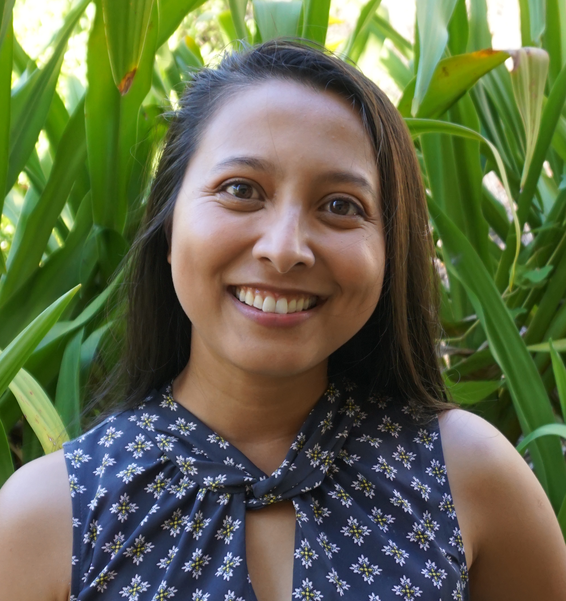
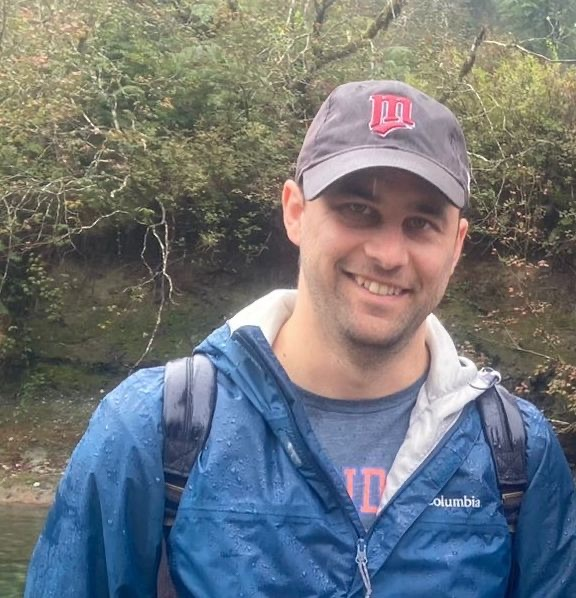
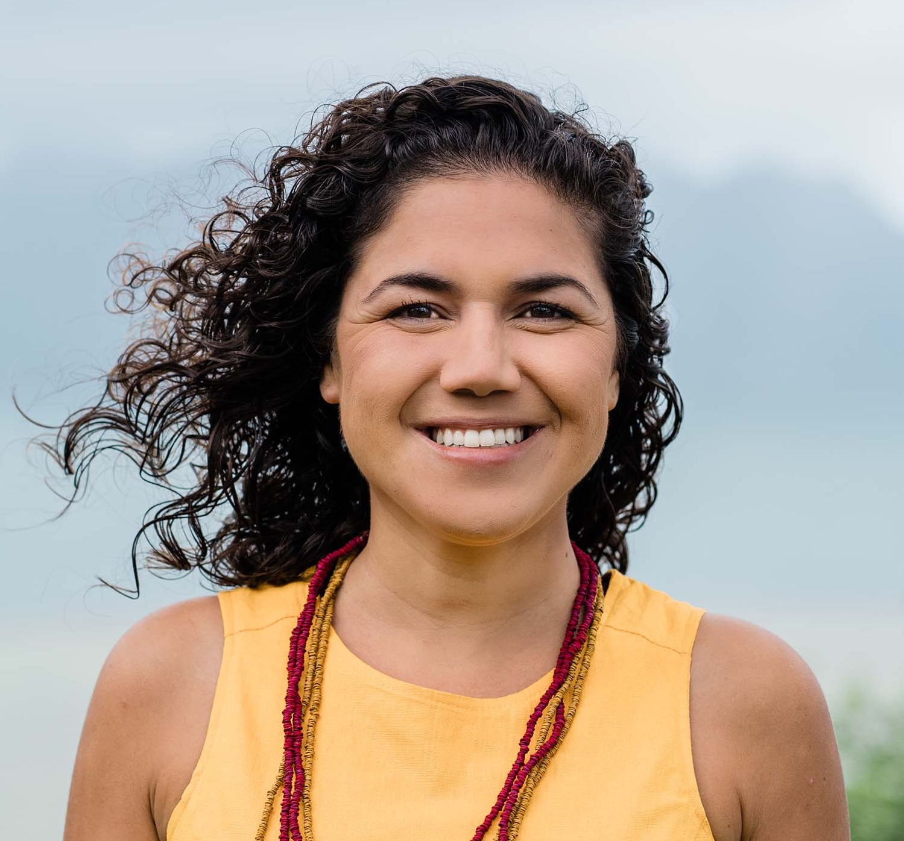
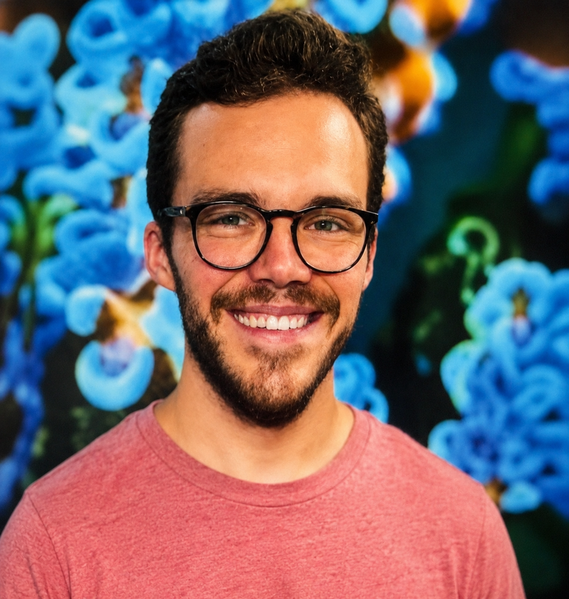
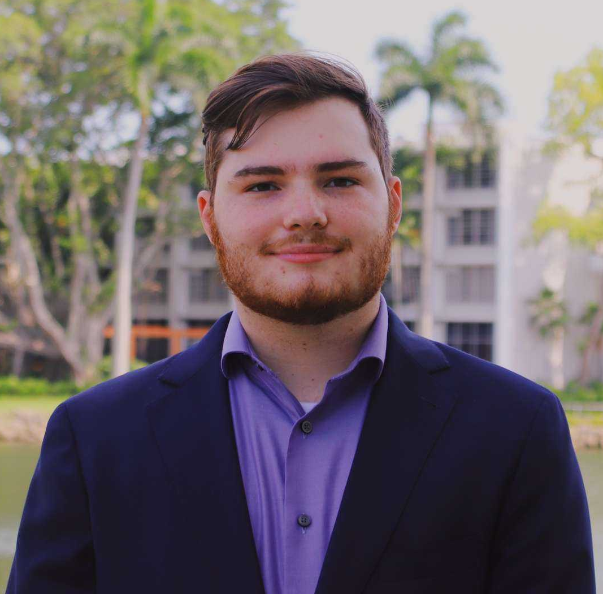
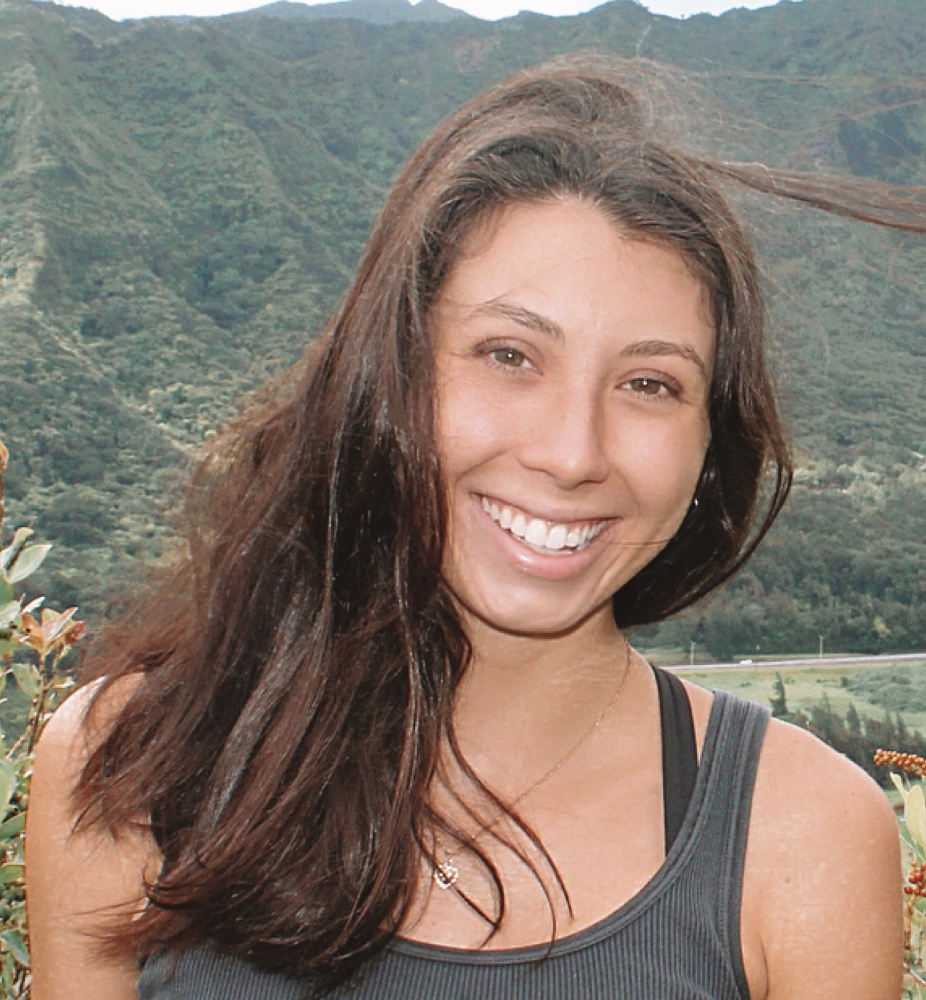
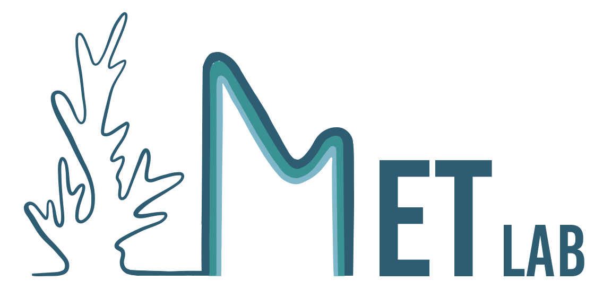

 PI: Lisa C. McManus, Ph.D. - <a href="McManus_Lisa_CV.pdf">CV (Updated Oct 2025)</a>   
 mcmanusl (at) hawaii (dot) edu   
 

  
I'm a marine ecologist and theoretician working at the <a href="http://www.himb.hawaii.edu/"> Hawai'i Institute of Marine Biology </a> (University of Hawai'i-Manoa) as an Associate Research Professor. My research focuses on the ecological and evolutionary drivers of coral reef dynamics, and I'm particularly interested in the effects of climate change on coral population persistence. I met my first corals in the waters off a small coastal town in the Philippines called Bolinao, where I spent the earliest years of my life. I've since explored reefs all over the world, though I've spent most of my scientific underwater time in the central Philippines and Florida Keys.

I use mathematical and computational approaches to investigate the role of networks on coral adaptive capacity using <a href="https://doi.org/10.1101/2021.02.04.429453">an eco-evolutionary framework that incorporates competition, dispersal and directional selection</a>. I've also conducted work to understand the factors that maintain stability on reefs, including the possibility of alternative stable states, both at <a href="https://doi.org/10.1007/s12080-018-0388-x">a single reef patch</a> and across thousands of reefs in <a href="https://doi.org/10.1111/gcb.14972">the Coral Triangle</a>. Many of my models use larval dispersal estimates derived from ocean circulation models.

I earned my Bachelor's degree from the University of Miami's Rosenstiel School of Marine and Atmospheric Science, and my PhD from the Department of Ecology and Evolutionary Biology at Princeton University through the <a href="https://slevin.princeton.edu/">Levin Lab</a>. I was subsequently a postdoctoral fellow with the
<a href="https://globalchange.sites.ucsc.edu/people/malin-pinsky/">Pinsky Lab</a> at Rutgers University (now at UC Santa Cruz).  

 
 
<a href="https://scholar.google.com/citations?user=V3bswmgAAAAJ&hl=en"> {width=6%} </a>

 
 
 Postdoctoral Researchers   

 
<a href="https://davidmerrillanderson.weebly.com/">
David M. Anderson, Ph.D. 
</a>   
 da4786 (at) hawaii (dot) edu   
 

My research focuses on the strategies that organisms employ to acquire, transform, and allocate energy and material resources. How do these strategies evolve in changing environments, how are they constrained by physiology, and how do they influence ecological processes and functions?  I address these questions with a combination of quantitative and empirical approaches, and I work primarily on aquatic systems and organisms. Here in the MET lab at HIMB, I am working to better understand the structure and dynamics of coral-algal symbioses.

 
 
 
 
 
 

 Mariana Rocha de Souza, M.Sc., Ph.D.   
 mrds (at) hawaii (dot) edu   
 

I am a coral reef biologist interested on the drivers of coral resilience in the face of climate change, especially the role of the symbiont algae in promoting resilience and recovery to inform conservation strategies. In my research, I have used genetics and <a href="https://www.frontiersin.org/articles/10.3389/fmars.2023.1108365/full">monitoring techniques</a> to identify the algal symbiont present in corals under different <a href="https://royalsocietypublishing.org/doi/full/10.1098/rsos.212042">environmental conditions</a>, <a href="https://www.researchsquare.com/article/rs-640089/v1">stress exposures</a> and bleaching events as well as patterns of coral <a href="https://onlinelibrary.wiley.com/doi/full/10.1111/mec.16655">genetic diversity</a>. I was born and raised in Brazil, and feel in love with the ocean, from a young age, when visiting beaches near my hometown. I have since been lucky to explore reefs in different parts of the world (Palau, Red Sea, Moorea, Australia) but I have spent most of my underwater time in Hawaiʻi.
I am also very interested in the intersection of science and policy. After my PhD, I was a John A. Knauss marine fellow placed at the Global Ocean Monitoring and Observing Systems at NOAA. I am also part of the conservation committee of the International Coral Reef Society and attend COPs as part of their delegation to advocate for coral conservation. As a Latina, I actively try to promote inclusion and diversity in science through continuous outreach efforts in schools and podcasts.
I earned my Ph.D in marine biology at the University of Hawaiʻi  at Mānoa at the Hawaiʻi Institute of Marine Biology under Ruth Gates and Rob Toonen, my masters in Oceanography at the University Aix Marseille, France and my BA in biology at the University of São Paulo, Brazil. 

 
 

 Graduate Students   

 
<a href="https://www.linkedin.com/in/finniancashel/">
Finnian Cashel 
</a>   
 fcashel (at) hawaii (dot) edu   
 

I am a Ph.D. student in Marine Biology at the University of Hawaiʻi at Mānoa’s Hawaiʻi Institute of Marine Biology. I earned my B.S. in Marine Biology from the College of Charleston’s Honors College in 2020. Before beginning my Ph.D., I worked as an ORISE Research Fellow with the U.S. Environmental Protection Agency and as a Research Intern with the Australian Institute of Marine Science. My research examines the physical drivers of larval connectivity on coral reefs and how these processes influence population connectivity, community dynamics, and the resilience of reef ecosystems under climate change. I am interested in interdisciplinary, collaborative approaches that advance reef restoration andsupport marine conservation efforts in partnership with federal, state, and local organizations. In my free time, I enjoy scuba diving, sailing, hiking, skiing, and spending time with friends and family.
 
 
 
 

 Nathan Fitzpatrick   
 nmf68 (at) hawaii (dot) edu   
 

I am a current PhD student and researcher at the University of Hawai'i, Manoa studying Marine Biology. I graduated from the University of Miami with a bachelors in Marine Biology and Computer Science. I employ my computational background in my research in the marine sciences across a variety of methods such as agent based modelling, numerical modelling, and machine learning techniques. I specifically have an interest in modeling ecological systems and am currently working with machine learning supervised models of ecological regime shifts.
 
 
 
 
 
 
 
 

 Shelbie Ishimaru   
 shelbiei (at) hawaii (dot) edu   
 

I’m a Ph.D. student studying Marine Biology at the UH Mānoa’s Hawaiʻi Institute of Marine Biology. Being born and raised in Kailua, Hawaiʻi has fueled my passion for conservation especially within the marine environment. I am broadly interested in population dynamics and abundance estimation using mark recapture modeling techniques. I am currently researching population abundance of the Hawaiian green sea turtle (honu) and potential climate-induced stressors to the population. 

 
 
 
 
 
 
 
 

 Sophia Rahnke   
 srahnke (at) hawaii (dot) edu   
 

I'm a Ph.D. candidate broadly interested in the biology, ecology, and conservation of coral reef ecosystems. I'm particularly interested in studying questions at the intersection of biology and policy, and hope that my work will connect these components to achieve conservation and sustainability goals. My research will use modeling as a tool to understand coral reef fisheries as social-ecological systems and assess the effectiveness of different forms of management in Hawaiʻi under predicted climate change scenarios. 

 
 
 
 
 
 
 
 

 Jake Snyder   
 jtsnyder (at) hawaii (dot) edu   
 

Hi! My name is Jake Snyder (he/they), and I am a Ph.D. candidate researching the impact of sedimentation on the interactions between fish herbivory, algal cover, and coral growth. I was raised in Hummelstown, Pennsylvania, and I earned my Bachelor of Science in Biology with minors in art and marine science from The Pennsylvania State University in Spring 2023. During my undergraduate career, I conducted research in Dr. Mónica Medina’s lab at Penn State and completed an internship with NOAA PIFSC through the Ernest F. Hollings Scholarship. Outside of my research, I am passionate about art and LGBTQIA+ advocacy.

 
 
 
 
 
 
 
 

 METLab Alumni   

 Seychelle Brainard   
Seychelle was an undergraduate researcher in the lab from Summer 2024 to Spring 2025. 
  

 Amanda Campos   
Amanda was a visiting PhD candidate researcher from the University of São Paulo, Brazil. Amanda was in the lab from Summer 2024 to Summer 2025.
  

 Sophia Girand   
Sophia was an undergraduate researcher in the lab during Summer 2023.
  

 Annie Innes-Gold, Ph.D.   
Annie was a Ph.D. student in the lab from Spring 2021 to Fall 2025. She is currently a postdoctoral researcher at the University of British Columbia.

Thesis: <i>Where People Meet the Sea: Climate Change, Resource Management, and Biocultural Restoration Drive Fish Population and Fisheries Dynamics in Hawaiʻi</i>
  

 Eojin Lee   
Eojin was an undergraduate researcher in the lab from Fall 2021 to Spring 2024 and was a lab technician during Summer 2024.
  

 Katherine Lew   
Katherine was an high school researcher in the lab during Fall 2020.
  

 Josh Pablo   
Josh was an undergraduate researcher from Spring 2023 to Fall 2025 and our lab manager until Summer 2026. He is currently a graduate student at the University of Hawaiʻi at Mānoa's Fisheries Graduate Program.
  

 Noam Vogt-Vincent, Ph.D.   
Noam was a postdoctoral researcher in the lab from Fall 2023 to Summer 2025. Noam is now an Associate Professor in the Department of Earth Sciences at the University of Oxford.
  

 

