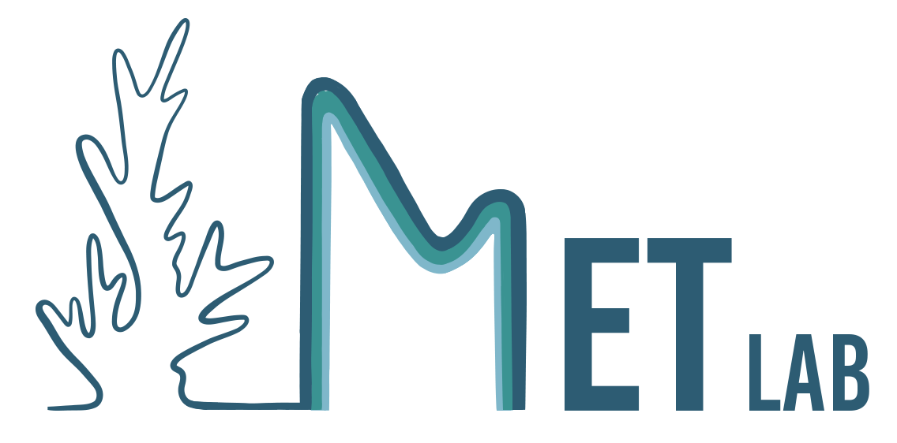

These are some of the projects we are currently working on.

<!--! --->

 

### Scientific Machine Learning for Ecosystem Regime Shifts
This project focuses on developing Scientific Machine Learning (SciML) tools for predicting ecosystem regime shifts. This approach combines the predictive power of machine learning with scientific understanding of ecological dynamics to address critical ecosystem-level challenges. Using Universal Differential Equations, we are advancing machine learning capabilities for ecological dynamics. We are applying SciML to forecast regime shifts in tropical coral ecosystems, freshwater lakes with harmful algal blooms, and mangrove ecosystems. Overall, this project seeks to improve predictive methods for ecosystem changes, enhance interpretability for stakeholders, and promote equitable science by reducing data requirements for predictions in data-poor systems.
 
 
 

  
### Eco-evolutionary dynamics on networks
This research area investigates the interplay between ecological and evolutionary processes in shaping population responses to climate change. We focus on disentangling these processes to assess climate change impacts on connected populations and communities. Using network theory and theoretical modeling, we simulate the adaptive responses of populations under rapid environmental change, considering factors such as demography, selection, and dispersal of heritable traits. Our work has revealed unexpected findings, such as the potentially negative impact of gene flow on population persistence in certain network structures. Current projects extend this approach to Large Marine Ecosystems, examining how temperature increase rates and spatial temperature ranges influence community dynamics and species diversity over time.
 

Relevant work: <a href = "https://doi.org/10.1002/ecy.3381">McManus et al. (2021) Ecology</a>

 
 
 
 

### Adaptive capacity of coral populations  
  
 
Our research focuses on quantifying the adaptive capacity of coral populations in response to climate change, a crucial factor in promoting ecosystem resilience. Adaptation is a complex process involving both evolutionary (including gene flow and selection) and ecological components (including dispersal and competition), which are interconnected through feedback loops. To address this complexity, we are applying eco-evolutionary models to real-world scenarios, specifically studying reef networks in the Caribbean and Indo-Pacific regions. Our aim is to predict coral adaptation patterns under rising sea temperatures. Through this work, we seek to disentangle the various eco-evolutionary processes at play, allowing us to better assess the impacts of climate change on coral reef metapopulations and metacommunities.

Relevant work:   
<a href = "https://par.nsf.gov/servlets/purl/10474274">Colton et al. (2022) Nature Ecology and Evolution</a>  
<a href = "https://doi.org/10.1111/gcb.15725">McManus et al. (2021) Global Change Biology</a>  
<a href = "https://doi.org/10.1111/gcb.14972">McManus et al. (2020) Global Change Biology</a>  

 
 

### Spatial management for evolving coral populations
   
 
How should we conserve evolving populations at the regional scale? In this project, we are exploring the efficacy of different spatial management strategies, including approaches that target "refugia" (typically cooler sites in the network) and those that target potential sources of warm-adapted larvae (that are generally more vulnerable to the effects of climate change).  
 
 

### Indigenous and Contemporary Marine Resource Management in Hawaiʻi
Our research integrates Indigenous practices with contemporary strategies to manage Hawaiʻi's culturally and economically significant marine resources. We focus on two key projects: (1) assessing the ecosystem impacts of Indigenous practices, such as loko iʻa (fishponds), on Hawaiian reefs and surrounding areas, and (2) developing social-ecological models to evaluate both Indigenous and modern management approaches. By studying cross-habitat linkages and incorporating historical ecological data, we aim to understand how these practices affect marine communities and overall ecosystem productivity. This research seeks to enhance the sustainability of marine resources and increase community resilience against climate change.

Relevant work:   
<a href = "https://esajournals.onlinelibrary.wiley.com/doi/full/10.1002/ecs2.4797">Innes-Gold et al. (2024) Ecosphere</a>  

 

 

